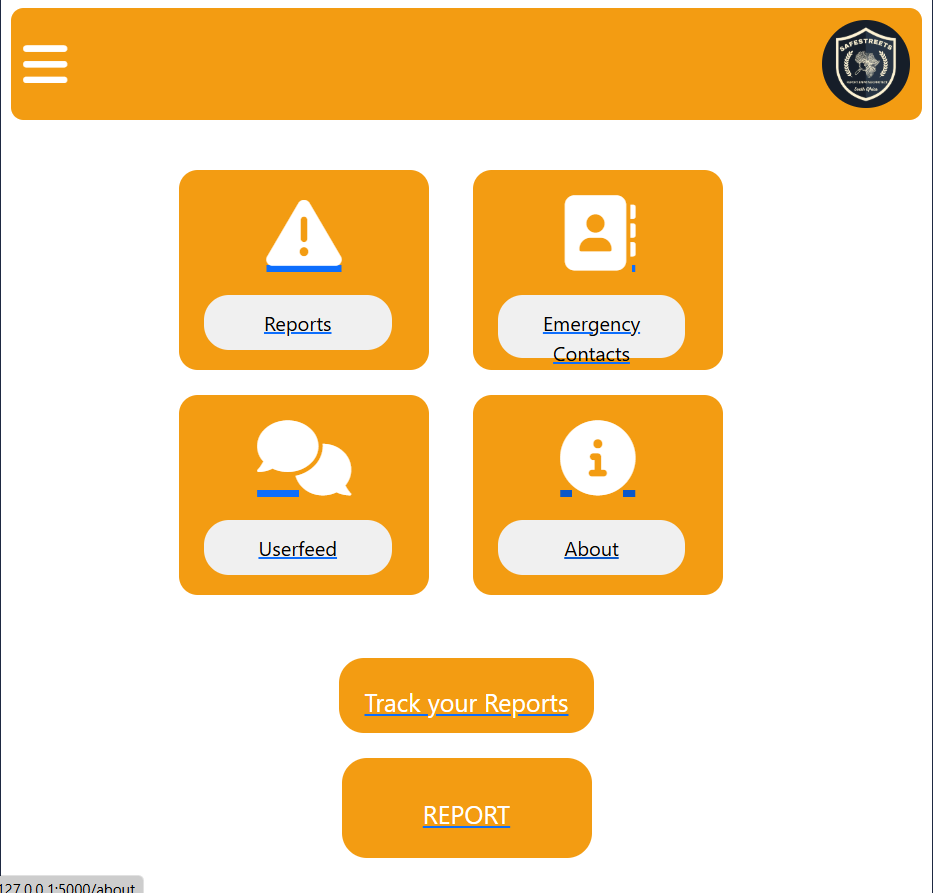

# Crime Reporting App 🚨  
(Group Project)
Welcome to **SafeStreets**, a community-focused app that uses technology to enhance public safety. With a user-friendly interface, this platform makes it easy to report crimes, stay updated on incidents nearby and empower communities with actionable insights. Whether you're reporting a petty theft or a serious crime, **SafeStreets** aims to foster safer neighborhoods by enabling faster responses and creating awareness.  

This is a student-driven initiative, showcasing how innovative solutions can make a real-world impact.  

---

## 🌟 Features  

### 🚨 **Crime Reporting**  
Submit crime reports quickly by filling in crucial details such as:  
- Location  
- Type of crime  
- Description  
- Date and time  

### 🗺️ **Interactive Crime Maps**  
Visualize crime reports on an intuitive map interface.  
- View locations of incidents in real-time.  
- Filter reports by type, severity, or time frame.  

### 🔔 **Real-Time Notifications**  
Stay up to date with:  
- Alerts about incidents in your area.  
- Updates on ongoing investigations.  

### 👤 **User Profiles**  
Personalize your experience:  
- Manage your submitted reports.  
- Track crimes or incidents you’ve viewed or flagged.  

### 📊 **Data Insights and Visualization**  
Gain deeper insights with interactive charts:  
- Analyze crime trends over time.  
- Identify hotspots using statistical data.  

### 🎥 **Media Uploads**  
Enhance reports with:  
- Images 📷  
- Videos 🎥 
- Audio recordings 🎤 

This provides additional context, helping authorities respond effectively.  

---

## 🛠️ Installation  

### Prerequisites  

Before getting started, ensure you have the following installed on your system:  

- **Python 3.x** 🐍  
- **Flask Framework** 🌐 
- **SQLite** 🗄️ for database storage  
- Virtual Environment (highly recommended) 💻  
- **Matplotlib** 📊 for generating charts and graphs  
- **Flask-Uploads** 🎥 for managing media files  

---

### Screenshots
Login

Register

Home

Account

Notifications

Report

Confirm Report

Dashboard

## 🌐 Live Demo

Check out the live version of my portfolio: [Your Portfolio URL](#)

---

## 🤝 Contributing

I’m always open to suggestions and feedback! If you have ideas to improve the website:

1. Fork the repository.
2. Create a new branch.
3. Submit a pull request with your enhancements.

---

## 📩 Contact Me

Feel free to connect with me via:

- **Email**: agnesmabusela12@gmail.com  
- **LinkedIn**: [Agnes Mabusela](https://www.linkedin.com/in/agnes-mabusela)  
- **GitHub**: [Agnes-99](https://github.com/Agnes-99)

---

## 🖋️ License

This project is licensed under the **MIT License**. Feel free to use, modify, and distribute this project as you see fit.
